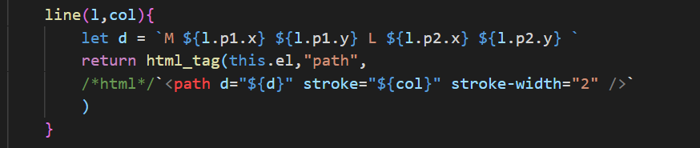

# web-js-utils
utilities as js functions for html, css and more
These utilities allow vanilla javascript based development without using cubursome framework, nor transpilers

# Import
ES6 modules export and import, not using classes for minimal code impact

```javascript
import {html,css,suid} from "./web-js-utils.js"
```

# 2.0.0
- no tagName required on the `html()` and `temp()` functions
- backward compatibility for some cases (SVG context) kept with `html_tag()` the difference is that `html()` is now simpler to use (no tagName redundancy) but does not set a context node bound to a tagName. More about the internally used function `createContextualFragment()` [here](https://developer.mozilla.org/en-US/docs/Web/API/Range/createContextualFragment).
- renamed entry to `index.js`

# 1.0.0
## html()
the `html()` function is extreamely simple yet powerful, especially when combined with a VS.Code plugin such as [es6-string-html](https://marketplace.visualstudio.com/items?itemName=Tobermory.es6-string-html)

* the example below takes an edge consisting of two points and and a color, returns an SVG path element



## defined()
improves code readability by reducing the existance check in javascript to a simple function call

## uid() suid()
unique identifiers for giving ids to components, using both time and a random number for fast components creation within the same millisecond

## send()
simplified custom events, forwards data into the detail member of the event

## temp()
similar to html but creates the component in a template, so does not require a parent, and helps for bottom up components struture building

## css()
`css()` allows writing parametric css in javascript. A VS.Code plugin [es6-string-css](https://marketplace.visualstudio.com/items?itemName=bashmish.es6-string-css) helps to highlight the css.

Just with this function, it is possible to argue on why a framework and a transpiler are required to use css in js while it's obiously that simple to embed css. Note that this is only possible thanks to `CSSStyleSheet()` concept. The function itself is wrapping a single call to `sheet.insertRule()` just to make it more readable.


## br()
save 36 characters or more, and so improve readability

## hr()
similar to br

## image()
creates an image component from the parent and url

## Events
a js replacement to jQuery events which could have some side effects and not have the expected behavior somethimes, e.g. with libraries such bootstrap toggle.

## save_json()
Object requires few steps before ending on a file

## rand_col()
random color generation

